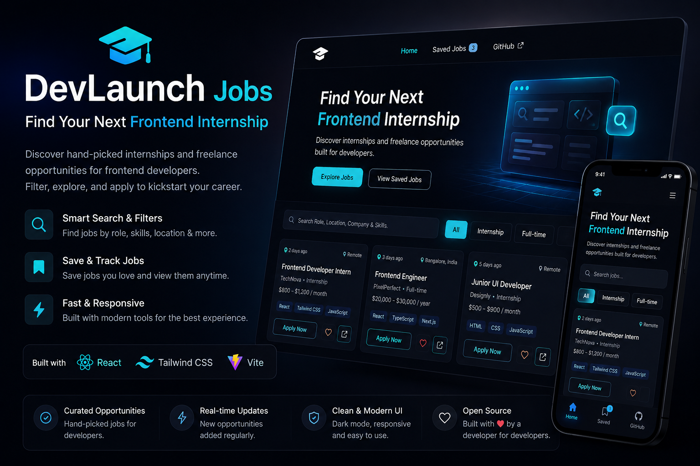
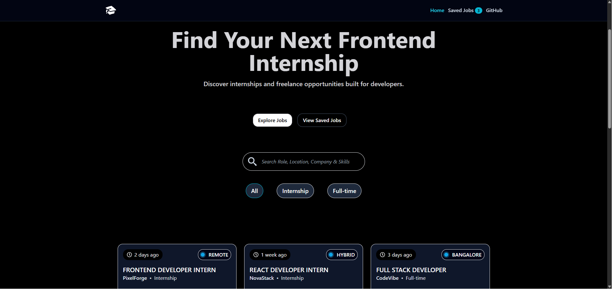
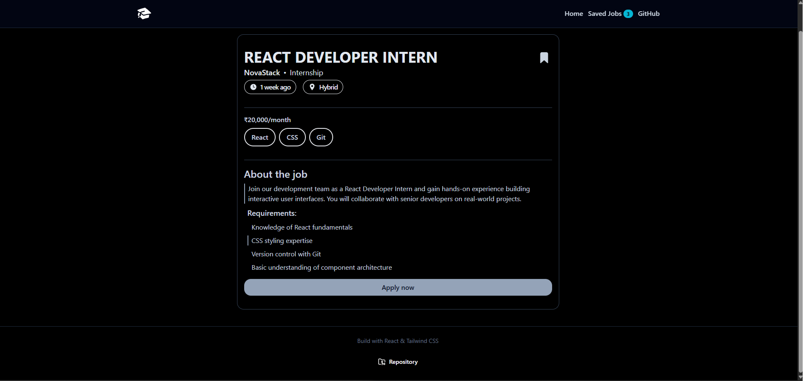
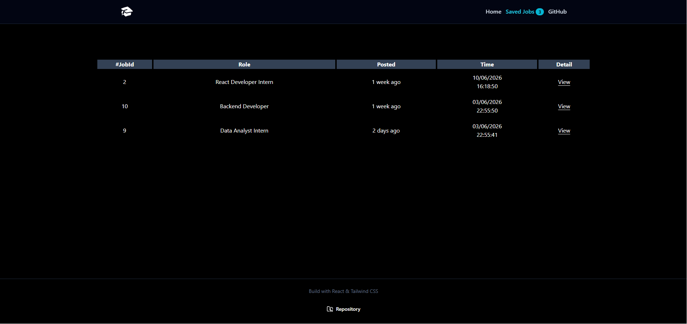
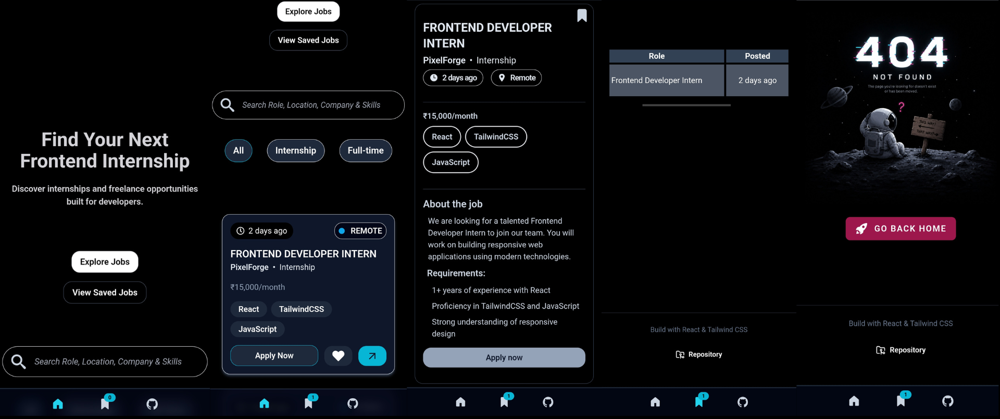

# DevLaunch Jobs
<p align="center">
  
</p>


A modern and responsive frontend job board built with React and Tailwind CSS.


🔗 Live Demo: https://dev-launch-jobs.vercel.app/

---

## Overview

DevLaunch Jobs helps developers discover internships and full-time opportunities through a clean and responsive interface.

Users can:

* Browse available jobs
* Search by role, company, location, or skills
* Filter by job type
* Save jobs for later
* View detailed job descriptions
* Access the application seamlessly across desktop and mobile devices

---

## Features

### Job Discovery

* Browse job listings
* Responsive card-based layout
* Dynamic job details pages

### Search & Filtering

* Search by:

  * Role
  * Company
  * Location
  * Skills
* Filter jobs by:

  * All
  * Internship
  * Full-time

### Saved Jobs

* Save favorite jobs
* Remove saved jobs
* Persistent storage using Local Storage
* Saved timestamp tracking

### User Experience

* Toast notifications
* Loading skeletons
* Empty states
* Error handling
* Active navigation states
* Mobile bottom navigation

### Accessibility

* Semantic HTML
* Keyboard-friendly controls

---

## Tech Stack

### Frontend

* React
* React Router DOM
* Tailwind CSS

### Libraries

* React Icons
* React Hot Toast

### Tools

* Vite
* ESLint

---

## Project Structure

```text
src
├── assets
│   ├── images
│   └── icons
├── components
│   ├── Navbar
│   │   ├── Navbar.jsx
│   │   └── Navbar.css
│   ├── Footer
│   │   ├── Footer.jsx
│   │   └── Footer.css
│   ├── UI
│   │   ├── JobCard.jsx
│   │   ├── SearchBar.jsx
│   │   ├── FilterButtons.jsx
│   │   ├── Skeleton.jsx
│   │   └── Toast.jsx
│   └── Layout
│       ├── MainLayout.jsx
│       └── Container.jsx
├── data
│   └── jobs.json
├── hooks
│   ├── useJobs.js
│   ├── useSavedJobs.js
│   └── useSearch.js
├── pages
│   ├── Home.jsx
│   ├── JobDetails.jsx
│   ├── SavedJobs.jsx
│   └── NotFound.jsx
├── services
│   ├── jobService.js
│   └── storageService.js
├── utils
│   ├── helpers.js
│   ├── validators.js
│   └── formatters.js
├── constants
│   ├── jobTypes.js
│   └── routes.js
├── App.jsx
├── App.css
└── index.css
```

---

## Screenshots

### Home Page



### Job Details



### Saved Jobs



### Mobile View



---

## Installation

Clone the repository:

```bash
git clone https://github.com/Hard1stf/DevLaunch-Jobs.git
```

Navigate into the project:

```bash
cd DevLaunch-Jobs
```

Install dependencies:

```bash
npm install
```

Run development server:

```bash
npm run dev
```

Build for production:

```bash
npm run build
```

Preview production build:

```bash
npm run preview
```

---

## Future Improvements

Potential future enhancements:

* Backend integration
* Real job APIs
* Authentication
* User profiles
* Job application tracking
* Pagination
* Dark/Light theme switcher

---

## Learning Outcomes

This project helped strengthen understanding of:

* React component architecture
* Custom Hooks
* React Router
* Local Storage persistence
* State management patterns
* Responsive UI design
* Reusable component systems
* Production-ready frontend structure

---

## Author

Hardik Vijeta

GitHub:
https://github.com/Hard1stf

Project Repository:
https://github.com/Hard1stf/DevLaunch-Jobs

Live Demo:
https://dev-launch-jobs.vercel.app/